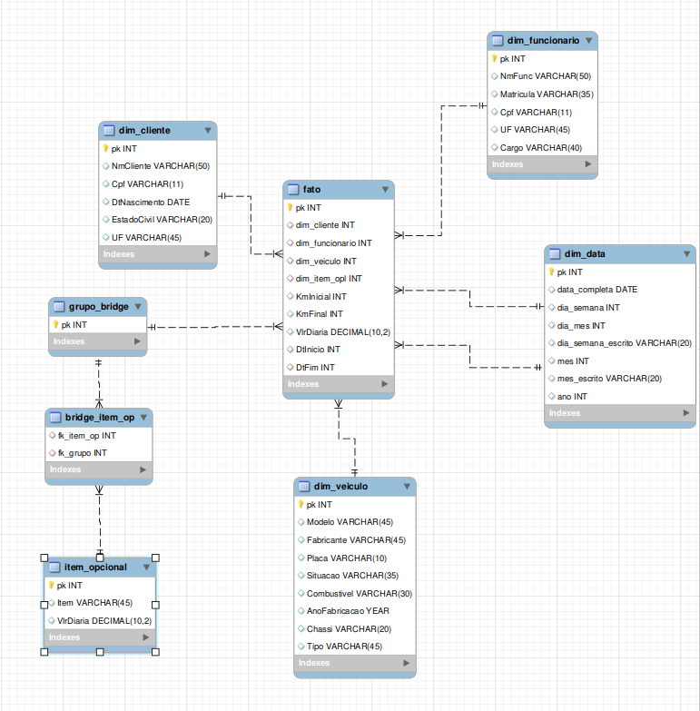

# Trabalho de inteligencai de negócios
[Especificações](./IN-Primeirotrabalho.pdf)
## Trabalho
Consiste em elaborar um data mart para uma locadora de veículos fictica, construir um banco apartir de um modelo lógico que no contexto servirá de OLTP, Construir uma modelagem dimensional em estrela respeitando a ordem aprensentada pelo Kimball.
### 1. Modelagem
1. Definir a granularidade;
2. Identificar as dimensões;
3. Identificar os fatos.

### 2. ETL
Obrigatóriamente deve-se ter uma dimensão data fazendo uso od matérial disponibilizado no AVA


## Modelo lógico 

## Modelo Fisico
```
CREATE TABLE EstadoCivil (
    cdEstadoCivil INTEGER PRIMARY KEY UNIQUE,
    DesEstadoCivil VARCHAR(30)
);

CREATE TABLE UF (
    CdUF INTEGER PRIMARY KEY UNIQUE,
    DesUF VARCHAR(45)
);

CREATE TABLE Fabricante (
    CdFabricante INTEGER PRIMARY KEY UNIQUE,
    DesFabricante VARCHAR(45)
);

CREATE TABLE TipoCombustivel (
    CdCombustivel INTEGER PRIMARY KEY UNIQUE,
    DesCombustivel VARCHAR(30)
);

CREATE TABLE TipoVeiculo (
    CdTipoVeiculo INTEGER PRIMARY KEY UNIQUE,
    DesTipoVeiculo VARCHAR(45)
);

CREATE TABLE Veiculo (
    CdVeiculo INTEGER PRIMARY KEY UNIQUE,
    Placa VARCHAR(10),
    Chassi VARCHAR(20),
    AnoFabricacao YEAR(4),
    Frabricante_CdFabricante INTEGER,
    TipoCombustivel_CdCombustivel INTEGER,
    ModeloVeiculo_cdModelo INTEGER,
    TipoVeiculo_CdTipoVeiculo INTEGER,
    SituacaoVeiculo_CdSituacao INTEGER
);

CREATE TABLE Cargo (
    CdCargo INTEGER PRIMARY KEY UNIQUE,
    DesCargo VARCHAR(45)
);

CREATE TABLE Funcionario (
    CodFuncionario INTEGER PRIMARY KEY UNIQUE,
    Matricula VARCHAR(15),
    NmFunc VARCHAR(100),
    Celular VARCHAR(15),
    Cpf VARCHAR(11),
    TelResidencial VARCHAR(15),
    Endereco LONGTEXT NULL,
    RG VARCHAR(10),
    Cargo_CdCargo INTEGER,
    UF_CdUf INTEGER
);

CREATE TABLE ManutencaoVeiculo (
    CdManutencao INTEGER PRIMARY KEY UNIQUE,
    DtSaida DATE,
    DtRetorno DATE,
    Veiculo_CdVeiculo INTEGER
);

CREATE TABLE ItemOpcional (
    CdOpcional INTEGER PRIMARY KEY,
    DesOpcional VARCHAR(45),
    VlrAtualDiaria DECIMAL(10,2)
);

CREATE TABLE LocacaoItemOpcional (
    Locacao_CdLocacao INTEGER,
    ItemOpcional_CdItemOpcional INTEGER
);

CREATE TABLE Locacao (
    CdLocacao INTEGER PRIMARY KEY UNIQUE,
    DtInicio DATE,
    DtFim DATE,
    VlrDiaria DECIMAL(10,2),
    KmInicial INTEGER,
    KmFinal INTEGER,
    Veiculo_CdVeiculo INTEGER,
    Funcionario_CdFuncionario INTEGER,
    Cliente_CdCliente INTEGER
);

CREATE TABLE ServicoManutencao (
    DtConclusao DATE,
    Observacoes LONGTEXT,
    ManutencaoVeiculo_CdManutencao INTEGER,
    ServicoManutencao INTEGER
);

CREATE TABLE Cliente (
    CdCliente INTEGER PRIMARY KEY,
    NmCliente VARCHAR(100),
    Email VARCHAR(50),
    Celular VARCHAR(15),
    Habilitacao VARCHAR(45),
    Cpf VARCHAR(11),
    DtNascimento DATE,
    TelefoneFixo VARCHAR(45),
    Endereco LONGTEXT NULL,
    EstadoCivil_CdEstadoCivil INTEGER,
    UF_CdUf INTEGER
);

CREATE TABLE Servico (
    CdServico INTEGER PRIMARY KEY,
    DesServico VARCHAR(45)
);

CREATE TABLE ModeloVeiculo (
    CdModelo INTEGER PRIMARY KEY,
    DesModelo VARCHAR(45)
);

CREATE TABLE SituacaoVeiculo (
    CdSituacao INTEGER PRIMARY KEY,
    DesSituacao VARCHAR(20)
);
... 
```
[Código completo do modelo Físico](./MODELO_FISICO.sql)  
[Código com carga de dados](./insert.sql)
## Modelagem
### Fast Immersion Canvas


### Fast Modelling Canvas


## Star Model


## Transformações no Pentaho


## Perguntas de negócio
Qual o dia da semana em que há mais locações?  
Tipo de veículo mais locado por dia da semana.  
Quantidade de locação de cada item opcional para um determinado período de tempo.  
Quais itens opcionais são mais locados por tipo de carro?  
Qual a média de idade do cliente por modelo de carro?  
Quantidade de clientes, por estado civil, que locam carros durante o fim de semana?  
Há um aumento de locações durante o natal?  
Qual a média de gasto em locação por idade?  
Qual a média de gasto com itens opcionais por idade?  
Qual a média de gasto com locação por estado civil?  
Quantidade de clientes por UF (estado onde reside) em um determinado mês.  
Quanto cada funcionário vendeu (considerando aluguel de opcionais e veículo) para um
período informado?  