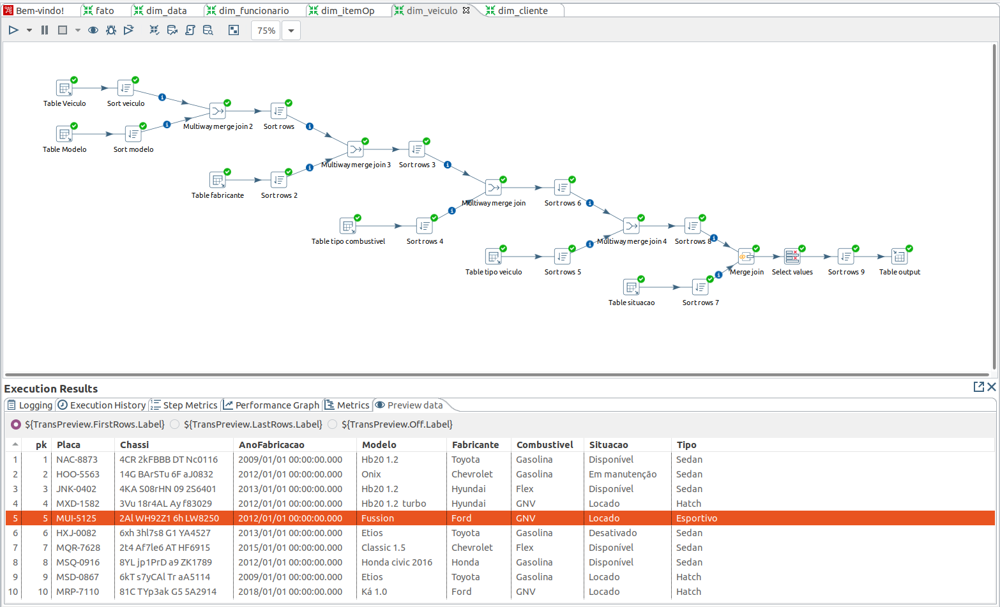
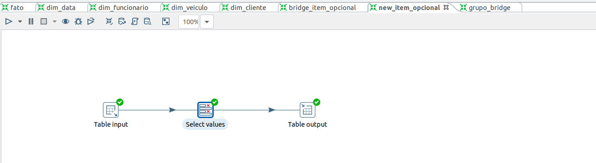
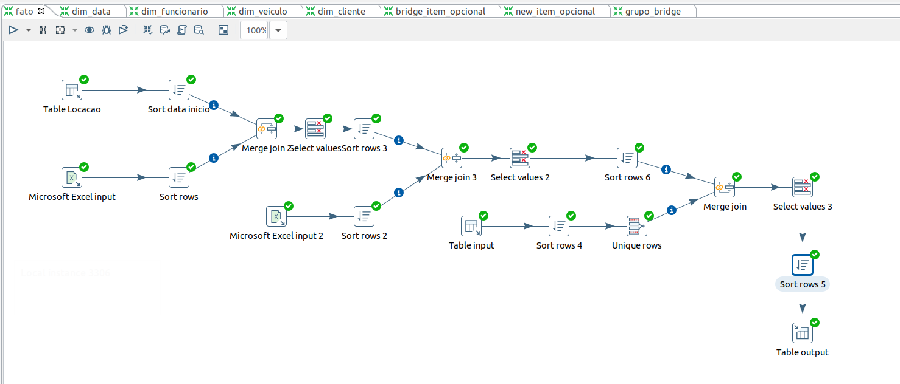

# Trabalho de inteligência de negócios

[Especificações](./IN-Primeirotrabalho.pdf)  
Alunos: 
1. Anne Caroline Silva
2. Marcelo P. Mendes 
## Trabalho
Consiste em elaborar um data mart para uma locadora de veículos fictícia, construir um banco apartir de um modelo lógico que no contexto servirá de OLTP, Construir uma modelagem dimensional em estrela respeitando a ordem apresentada pelo Kimball.
### 1. Modelagem
1. Definir a granularidade;
2. Identificar as dimensões;
3. Identificar os fatos.

### 2. ETL
Obrigatóriamente deve-se ter uma dimensão data fazendo uso do material disponibilizado no AVA


## Modelo lógico 

## Modelo Fisico
```
CREATE TABLE EstadoCivil (
    cdEstadoCivil INTEGER PRIMARY KEY UNIQUE,
    DesEstadoCivil VARCHAR(30)
);

CREATE TABLE UF (
    CdUF INTEGER PRIMARY KEY UNIQUE,
    DesUF VARCHAR(45)
);

CREATE TABLE Fabricante (
    CdFabricante INTEGER PRIMARY KEY UNIQUE,
    DesFabricante VARCHAR(45)
);

CREATE TABLE TipoCombustivel (
    CdCombustivel INTEGER PRIMARY KEY UNIQUE,
    DesCombustivel VARCHAR(30)
);

CREATE TABLE TipoVeiculo (
    CdTipoVeiculo INTEGER PRIMARY KEY UNIQUE,
    DesTipoVeiculo VARCHAR(45)
);

CREATE TABLE Veiculo (
    CdVeiculo INTEGER PRIMARY KEY UNIQUE,
    Placa VARCHAR(10),
    Chassi VARCHAR(20),
    AnoFabricacao YEAR(4),
    Frabricante_CdFabricante INTEGER,
    TipoCombustivel_CdCombustivel INTEGER,
    ModeloVeiculo_cdModelo INTEGER,
    TipoVeiculo_CdTipoVeiculo INTEGER,
    SituacaoVeiculo_CdSituacao INTEGER
);

CREATE TABLE Cargo (
    CdCargo INTEGER PRIMARY KEY UNIQUE,
    DesCargo VARCHAR(45)
);

CREATE TABLE Funcionario (
    CodFuncionario INTEGER PRIMARY KEY UNIQUE,
    Matricula VARCHAR(15),
    NmFunc VARCHAR(100),
    Celular VARCHAR(15),
    Cpf VARCHAR(11),
    TelResidencial VARCHAR(15),
    Endereco LONGTEXT NULL,
    RG VARCHAR(10),
    Cargo_CdCargo INTEGER,
    UF_CdUf INTEGER
);

CREATE TABLE ManutencaoVeiculo (
    CdManutencao INTEGER PRIMARY KEY UNIQUE,
    DtSaida DATE,
    DtRetorno DATE,
    Veiculo_CdVeiculo INTEGER
);

CREATE TABLE ItemOpcional (
    CdOpcional INTEGER PRIMARY KEY,
    DesOpcional VARCHAR(45),
    VlrAtualDiaria DECIMAL(10,2)
);

CREATE TABLE LocacaoItemOpcional (
    Locacao_CdLocacao INTEGER,
    ItemOpcional_CdItemOpcional INTEGER
);

CREATE TABLE Locacao (
    CdLocacao INTEGER PRIMARY KEY UNIQUE,
    DtInicio DATE,
    DtFim DATE,
    VlrDiaria DECIMAL(10,2),
    KmInicial INTEGER,
    KmFinal INTEGER,
    Veiculo_CdVeiculo INTEGER,
    Funcionario_CdFuncionario INTEGER,
    Cliente_CdCliente INTEGER
);

CREATE TABLE ServicoManutencao (
    DtConclusao DATE,
    Observacoes LONGTEXT,
    ManutencaoVeiculo_CdManutencao INTEGER,
    ServicoManutencao INTEGER
);

CREATE TABLE Cliente (
    CdCliente INTEGER PRIMARY KEY,
    NmCliente VARCHAR(100),
    Email VARCHAR(50),
    Celular VARCHAR(15),
    Habilitacao VARCHAR(45),
    Cpf VARCHAR(11),
    DtNascimento DATE,
    TelefoneFixo VARCHAR(45),
    Endereco LONGTEXT NULL,
    EstadoCivil_CdEstadoCivil INTEGER,
    UF_CdUf INTEGER
);

CREATE TABLE Servico (
    CdServico INTEGER PRIMARY KEY,
    DesServico VARCHAR(45)
);

CREATE TABLE ModeloVeiculo (
    CdModelo INTEGER PRIMARY KEY,
    DesModelo VARCHAR(45)
);

CREATE TABLE SituacaoVeiculo (
    CdSituacao INTEGER PRIMARY KEY,
    DesSituacao VARCHAR(20)
);
... 
```
[Código completo do modelo Físico](./locadora_fisico.sql)  

## Modelagem
### Fast Immersion Canvas


### Fast Modelling Canvas


## Star Model


### Modelo Estrela físico  
  
```

CREATE TABLE fato (
    pk INTEGER PRIMARY KEY,
    dim_cliente INTEGER,
    dim_funcionario INTEGER,
    dim_veiculo INTEGER,
    dim_item_opl INTEGER,
    KmInicial INTEGER,
    KmFinal INTEGER,
    VlrDiaria DECIMAL(10,2),
    DtInicio INTEGER,
    DtFim INTEGER
);

CREATE TABLE dim_data (
    pk INTEGER PRIMARY KEY,
    data_completa DATE,
    dia_semana INTEGER,
    dia_mes INTEGER,
    dia_semana_escrito VARCHAR(20),
    mes INTEGER,
    mes_escrito VARCHAR(20),
    ano INTEGER
);

CREATE TABLE dim_cliente (
    pk INTEGER PRIMARY KEY,
    NmCliente VARCHAR(50),
    Cpf VARCHAR(11),
    DtNascimento DATE,
    EstadoCivil VARCHAR(20),
    UF VARCHAR(45)
);

CREATE TABLE dim_funcionario (
    pk INTEGER PRIMARY KEY,
    NmFunc VARCHAR(50),
    Matricula VARCHAR(35),
    Cpf VARCHAR(11),
    UF VARCHAR(45),
    Cargo VARCHAR(40)
);

CREATE TABLE dim_veiculo (
    pk INTEGER PRIMARY KEY,
    Modelo VARCHAR(45),
    Fabricante VARCHAR(45),
    Placa VARCHAR(10),
    Situacao VARCHAR(35),
    Combustivel VARCHAR(30),
    AnoFabricacao YEAR(4),
    Chassi VARCHAR(20),
    Tipo VARCHAR(45)
);

CREATE TABLE grupo_bridge (
    pk INTEGER PRIMARY KEY AUTO_INCREMENT
);

CREATE TABLE bridge_item_op (
    /*pk INTEGER PRIMARY KEY AUTO_INCREMENT,*/
    fk_item_op INTEGER,
    fk_grupo INTEGER
);

CREATE TABLE item_opcional (
    pk INTEGER PRIMARY KEY,
    Item VARCHAR(45),
    VlrDiaria DECIMAL(10,2)
);
```

[Modelo estral Físico](./locadora_estrela_fisico.sql)

## Transformações no Pentaho
### Dimensão Cliente  


### Dimensão Funcionario


### Dimensão Veiculo


### Dimensão Data


### Dimensão itemOpcional



### Tabela Fato



[DUMP locadora](./DUMP_locadora.sql)  
[DUMP do modelo Estrela](./DUMP_estrela_fisico.sql)

## Perguntas de negócio
### 1. Qual o dia da semana em que há mais locações? 
```
SELECT  dia_semana_escrito, count(dia_semana_escrito) as soma 
FROM  fato
INNER JOIN dim_data
	on fato.DtInicio = dim_data.pk
GROUP BY dia_semana_escrito
ORDER BY soma DESC;
```


### 2.Tipo de veículo mais locado por dia da semana.
```
SELECT dia_semana_escrito, max(Tipo)
FROM fato
INNER JOIN dim_data
	on fato.DtInicio = dim_data.pk
INNER JOIN dim_veiculo
	on fato.dim_veiculo = dim_veiculo.pk
GROUP BY dia_semana_escrito ;  
```
  

### 3.Quantidade de locação de cada item opcional para um determinado período de tempo.
```
SELECT item, count(item)
FROM fato
INNER JOIN dim_item_op
	on dim_item_op.pk = fato.dim_item_opl
GROUP BY item; 
``` 
   
### 4. Quais itens opcionais são mais locados por tipo de carro?  
``` 
```
[]()
### 5. Qual a média de idade do cliente por modelo de carro?
```
SELECT Modelo,avg(year(curdate())-year(DtNascimento)) as 'média idade'
FROM fato
INNER JOIN dim_cliente
	on dim_cliente.pk = fato.dim_cliente
INNER JOIN dim_veiculo
	on dim_veiculo.pk = fato.dim_veiculo
GROUP BY Modelo;
```
  

### 6. Quantidade de clientes, por estado civil, que locam carros durante o fim de semana?  
### 7. Há um aumento de locações durante o natal?  

### 8. Qual a média de gasto em locação por idade?  
```
SELECT YEAR(curdate())-YEAR(DtNascimento) as 'idade', avg((DtFim-DtInicio)*VlrDiaria) as 'media gasta'
FROM fato
INNER JOIN dim_cliente
	on dim_cliente.pk = fato.dim_cliente
GROUP BY idade;   
```

### 9. Qual a média de gasto com itens opcionais por idade?  

### 10. Qual a média de gasto com locação por estado civil?
```
SELECT EstadoCivil, avg((DtFim-DtInicio)*VlrDiaria) as 'media gasta'
FROM fato
INNER JOIN dim_cliente
	on fato.dim_cliente = dim_cliente.pk
GROUP BY EstadoCivil; 
```
)
### 11. Quantidade de clientes por UF (estado onde reside) em um determinado mês. 
```
SELECT UF, COUNT(UF)
FROM fato
INNER JOIN dim_cliente
	on fato.dim_cliente = dim_cliente.pk
GROUP BY UF; 
``` 

### 12. Quanto cada funcionário vendeu (considerando aluguel de opcionais e veículo) para um período informado?  


## Como rodar

```
    docker-compose down -v
    docker-compose up --build
```
